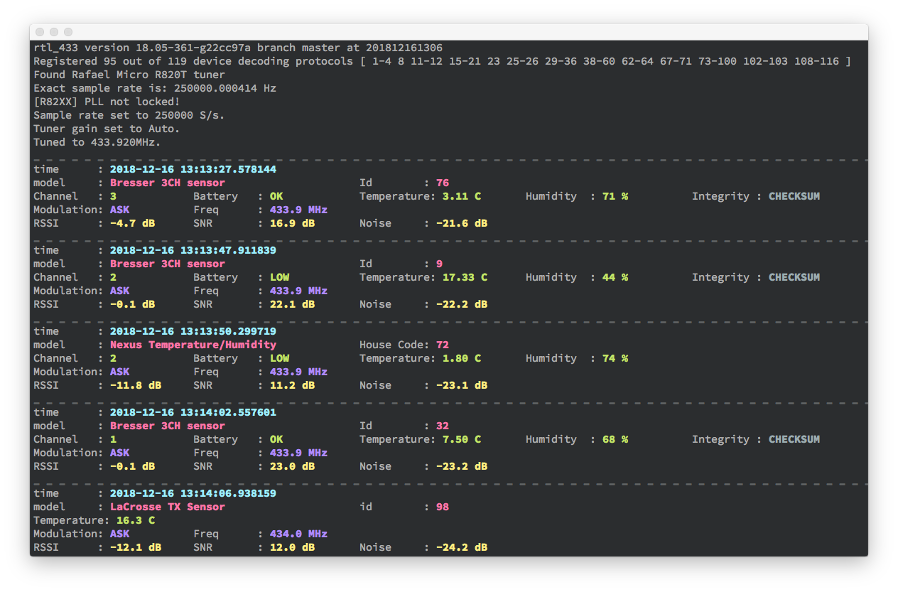

rtl_433
=======

rtl_433 (despite the name) is a generic data receiver, mainly for the 433.92 MHz, 868 MHz (SRD), 315 MHz, and 915 MHz ISM bands.

It works with [RTL-SDR](https://github.com/osmocom/rtl-sdr/) and/or [SoapySDR](https://github.com/pothosware/SoapySDR/).
Activly tested and supported are Realtek RTL2832 based DVB dongles (using RTL-SDR) and LimeSDR ([LimeSDR USB](https://www.crowdsupply.com/lime-micro/limesdr) and [LimeSDR mini](https://www.crowdsupply.com/lime-micro/limesdr-mini) engineering samples kindly provided by [MyriadRf](https://myriadrf.org/)), PlutoSDR, HackRF One (using SoapySDR drivers), as well as SoapyRemote.



Building/installation:
----------------------

See [BUILDING.md](BUILDING.md)

How to add support for unsupported sensors
------------------------------------------

Read the Test Data section at the bottom.

Running:
--------

    rtl_433 -h

```
Usage:	= General options =
	[-V] Output the version string and exit
	[-v] Increase verbosity (can be used multiple times).
		 -v : verbose, -vv : verbose decoders, -vvv : debug decoders, -vvvv : trace decoding).
	[-c <path>] Read config options from a file
	= Tuner options =
	[-d <RTL-SDR USB device index> | :<RTL-SDR USB device serial> | <SoapySDR device query> | rtl_tcp]
	[-g <gain>] (default: auto)
	[-f <frequency>] [-f...] Receive frequency(s) (default: 433920000 Hz)
	[-H <seconds>] Hop interval for polling of multiple frequencies (default: 600 seconds)
	[-p <ppm_error] Correct rtl-sdr tuner frequency offset error (default: 0)
	[-s <sample rate>] Set sample rate (default: 250000 Hz)
	= Demodulator options =
	[-R <device>] Enable only the specified device decoding protocol (can be used multiple times)
		 Specify a negative number to disable a device decoding protocol (can be used multiple times)
	[-G] Enable all device protocols, included those disabled by default
	[-X <spec> | help] Add a general purpose decoder (-R 0 to disable all other decoders)
	[-l <level>] Change detection level used to determine pulses [0-16384] (0 = auto) (default: 0)
	[-z <value>] Override short value in data decoder
	[-x <value>] Override long value in data decoder
	[-n <value>] Specify number of samples to take (each sample is 2 bytes: 1 each of I & Q)
	= Analyze/Debug options =
	[-a] Analyze mode. Print a textual description of the signal.
	[-A] Pulse Analyzer. Enable pulse analysis and decode attempt.
		 Disable all decoders with -R 0 if you want analyzer output only.
	[-y <code>] Verify decoding of demodulated test data (e.g. "{25}fb2dd58") with enabled devices
	= File I/O options =
	[-S none|all|unknown|known] Signal auto save. Creates one file per signal.
		 Note: Saves raw I/Q samples (uint8 pcm, 2 channel). Preferred mode for generating test files.
	[-r <filename>] Read data from input file instead of a receiver
	[-w <filename>] Save data stream to output file (a '-' dumps samples to stdout)
	[-W <filename>] Save data stream to output file, overwrite existing file
	= Data output options =
	[-F kv|json|csv|syslog|null] Produce decoded output in given format.
		 Append output to file with :<filename> (e.g. -F csv:log.csv), defaults to stdout.
		 Specify host/port for syslog with e.g. -F syslog:127.0.0.1:1514
	[-M time|reltime|notime|hires|utc|protocol|level|bits] Add various meta data to every output line.
	[-K FILE|PATH|<tag>] Add an expanded token or fixed tag to every output line.
	[-C native|si|customary] Convert units in decoded output.
	[-T <seconds>] Specify number of seconds to run
	[-E] Stop after outputting successful event(s)
	[-h] Output this usage help and exit
		 Use -d, -g, -R, -X, -F, -M, -r, or -w without argument for more help

Supported device protocols:
    [01]  Silvercrest Remote Control
    [02]  Rubicson Temperature Sensor
    [03]  Prologue Temperature Sensor
    [04]  Waveman Switch Transmitter
    [06]* ELV EM 1000
    [07]* ELV WS 2000
    [08]  LaCrosse TX Temperature / Humidity Sensor
    [10]* Acurite 896 Rain Gauge
    [11]  Acurite 609TXC Temperature and Humidity Sensor
    [12]  Oregon Scientific Weather Sensor
    [13]* Mebus 433
    [14]* Intertechno 433
    [15]  KlikAanKlikUit Wireless Switch
    [16]  AlectoV1 Weather Sensor (Alecto WS3500 WS4500 Ventus W155/W044 Oregon)
    [17]  Cardin S466-TX2
    [18]  Fine Offset Electronics, WH2, WH5, Telldus Temperature/Humidity/Rain Sensor
    [19]  Nexus Temperature & Humidity Sensor
    [20]  Ambient Weather Temperature Sensor
    [21]  Calibeur RF-104 Sensor
    [22]* X10 RF
    [23]  DSC Security Contact
    [24]* Brennenstuhl RCS 2044
    [25]  GT-WT-02 Sensor
    [26]  Danfoss CFR Thermostat
    [29]  Chuango Security Technology
    [30]  Generic Remote SC226x EV1527
    [31]  TFA-Twin-Plus-30.3049 and Ea2 BL999
    [32]  Fine Offset Electronics WH1080/WH3080 Weather Station
    [33]  WT450
    [34]  LaCrosse WS-2310 Weather Station
    [35]  Esperanza EWS
    [36]  Efergy e2 classic
    [37]* Inovalley kw9015b, TFA Dostmann 30.3161 (Rain and temperature sensor)
    [38]  Generic temperature sensor 1
    [39]  WG-PB12V1 Temperature Sensor
    [40]  Acurite 592TXR Temp/Humidity, 5n1 Weather Station, 6045 Lightning
    [41]  Acurite 986 Refrigerator / Freezer Thermometer
    [42]  HIDEKI TS04 Temperature, Humidity, Wind and Rain Sensor
    [43]  Watchman Sonic / Apollo Ultrasonic / Beckett Rocket oil tank monitor
    [44]  CurrentCost Current Sensor
    [45]  emonTx OpenEnergyMonitor
    [46]  HT680 Remote control
    [47]  S3318P Temperature & Humidity Sensor
    [48]  Akhan 100F14 remote keyless entry
    [49]  Quhwa
    [50]  OSv1 Temperature Sensor
    [51]  Proove
    [52]  Bresser Thermo-/Hygro-Sensor 3CH
    [53]  Springfield Temperature and Soil Moisture
    [54]  Oregon Scientific SL109H Remote Thermal Hygro Sensor
    [55]  Acurite 606TX Temperature Sensor
    [56]  TFA pool temperature sensor
    [57]  Kedsum Temperature & Humidity Sensor
    [58]  Blyss DC5-UK-WH
    [59]  Steelmate TPMS
    [60]  Schrader TPMS
    [61]* LightwaveRF
    [62]  Elro DB286A Doorbell
    [63]  Efergy Optical
    [64]  Honda Car Key
    [67]  Radiohead ASK
    [68]  Kerui PIR / Contact Sensor
    [69]  Fine Offset WH1050 Weather Station
    [70]  Honeywell Door/Window Sensor
    [71]  Maverick ET-732/733 BBQ Sensor
    [72]* RF-tech
    [73]  LaCrosse TX141-Bv2/TX141TH-Bv2 sensor
    [74]  Acurite 00275rm,00276rm Temp/Humidity with optional probe
    [75]  LaCrosse TX35DTH-IT, TFA Dostmann 30.3155 Temperature/Humidity sensor
    [76]  LaCrosse TX29IT Temperature sensor
    [77]  Vaillant calorMatic 340f Central Heating Control
    [78]  Fine Offset Electronics, WH25, WH24, WH65B, HP1000 Temperature/Humidity/Pressure Sensor
    [79]  Fine Offset Electronics, WH0530 Temperature/Rain Sensor
    [80]  IBIS beacon
    [81]  Oil Ultrasonic STANDARD FSK
    [82]  Citroen TPMS
    [83]  Oil Ultrasonic STANDARD ASK
    [84]  Thermopro TP11 Thermometer
    [85]  Solight TE44
    [86]  Wireless Smoke and Heat Detector GS 558
    [87]  Generic wireless motion sensor
    [88]  Toyota TPMS
    [89]  Ford TPMS
    [90]  Renault TPMS
    [91]  inFactory
    [92]  FT-004-B Temperature Sensor
    [93]  Ford Car Key
    [94]  Philips outdoor temperature sensor
    [95]  Schrader TPMS EG53MA4
    [96]  Nexa
    [97]  Thermopro TP08/TP12 thermometer
    [98]  GE Color Effects
    [99]  X10 Security
    [100]  Interlogix GE UTC Security Devices
    [101]* Dish remote 6.3
    [102]  SimpliSafe Home Security System (May require disabling automatic gain for KeyPad decodes)
    [103]  Sensible Living Mini-Plant Moisture Sensor
    [104]* Wireless M-Bus, Mode C&T, 100kbps (-f 868950000 -s 1200000)
    [105]* Wireless M-Bus, Mode S, 32.768kbps (-f 868300000 -s 1000000)
    [106]* Wireless M-Bus, Mode R, 4.8kbps (-f 868330000)
    [107]* Wireless M-Bus, Mode F, 2.4kbps
    [108]  WS Temperature Sensor
    [109]  WT0124 Pool Thermometer
    [110]  PMV-107J (Toyota) TPMS
    [111]  Emos TTX201 Temperature Sensor
    [112]  Ambient Weather TX-8300 Temperature/Humidity Sensor
    [113]  Ambient Weather WH31E Thermo-Hygrometer Sensor
    [114]  Maverick et73
    [115]  Honeywell Wireless Doorbell
    [116]  Honeywell Wireless Doorbell (FSK)
    [117]* ESA1000 / ESA2000 Energy Monitor
    [118]* Biltema rain gauge
    [119]  Bresser Weather Center 5-in-1
    [120]* Digitech XC-0324 temperature sensor

* Disabled by default, use -R n or -G

```


Some examples:

| Command | Description
|---------|------------
| `rtl_433` | Default receive mode, use the first device found, listen at 433.92 MHz at 250k sample rate.
| `rtl_433 -C si` | Default receive mode, also convert units to metric system.
| `rtl_433 -f 868M -s 1024k` | Listen at 868 MHz and 1024k sample rate.
| `rtl_433 -M hires -M level` | Report microsecond accurate timestamps and add reception levels (depending on gain).
| `rtl_433 -R 1 -R 8 -R 43` | Enable only specific decoders for desired devices.
| `rtl_433 -A` | Enable pulse analyzer. Summarizes the timings of pulses, gaps, and periods. Can be used with `-R 0` to disable decoders.
| `rtl_433 -S all -T 120` | Save all detected signals (`g###_###M_###k.cu8`). Run for 2 minutes.
| `rtl_433 -K FILE -r file_name` | Read a saved data file instead of receiving live data. Tag output with filenames.
| `rtl_433 -F json -M utc \| mosquitto_pub -t home/rtl_433 -l` | Will pipe the output to network as JSON formatted MQTT messages. A test MQTT client can be found in `tests/mqtt_rtl_433_test.py`.
| `rtl_433 -f 433.53M -f 434.02M -H 15` | Will poll two frequencies with 15 seconds hop interval.


Supporting Additional Devices and Test Data
-------------------------------------------

Some device protocol decoders are disabled by default. When testing to see if your device
is decoded by rtl_433, use `-G` to enable all device protocols.
This will likely produce false positives, use with caution.

The first step in decoding new devices is to record the signals using `-S all`.
The signals will be stored individually in files named g**NNN**\_**FFF**M\_**RRR**k.cu8 :

| Parameter | Description
|---------|------------
| **NNN** | signal grabbed number
| **FFF** | frequency
| **RRR** | sample rate   

This file can be played back with `rtl_433 -r gNNN_FFFM_RRRk.cu8`.

These files are vital for understanding the signal format as well as the message data.  Use both analyzers
`-a` and `-A` to look at the recorded signal and determine the pulse characteristics, e.g. `rtl_433 -r gNNN_FFFM_RRRk.cu8 -a -A`.

Make sure you have recorded a proper set of test signals representing different conditions together
with any and all information about the values that the signal should represent. For example, make a
note of what temperature and/or humidity is the signal encoding. Ideally, capture a range of data
values, such a different temperatures, to make it easy to spot what part of the message is changing.

Add the data files, a text file describing the captured signals, pictures of the device and/or
a link the manufacturer's page (ideally with specifications) to the rtl_433_tests
github repository. Follow the existing structure as best as possible and send a pull request.

https://github.com/merbanan/rtl_433_tests

Please don't open a new github issue for device support or request decoding help from others
until you've added test signals and the description to the repository.

The rtl_433_test repository is also used to help test that changes to rtl_433 haven't caused any regressions.

Google Group
------------

Join the Google group, rtl_433, for more information about rtl_433:
https://groups.google.com/forum/#!forum/rtl_433


Troubleshooting
---------------

If you see this error:

    Kernel driver is active, or device is claimed by second instance of librtlsdr.
    In the first case, please either detach or blacklist the kernel module
    (dvb_usb_rtl28xxu), or enable automatic detaching at compile time.

then

    sudo rmmod dvb_usb_rtl28xxu rtl2832
